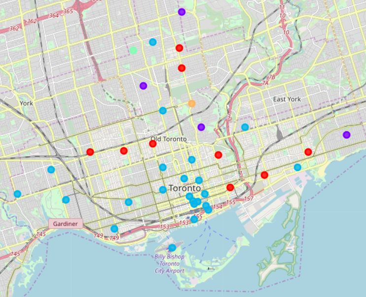
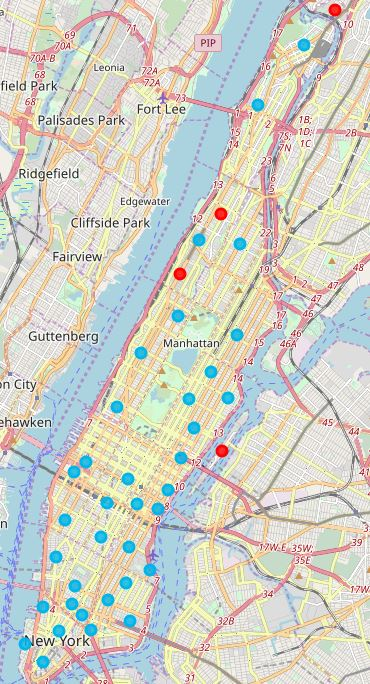

_Note: The notebook for this project can be found [here](https://dataplatform.cloud.ibm.com/analytics/notebooks/v2/4ba6e9a9-4692-476b-8f6a-f29aca334fbc/view?access_token=7e97492aaecebdf427b9dff1f24536b4f8f596f8a83fec3bed8fe3dda5fcfa33) (also named city-comparison)._
### I. Introduction
#### 1.1 Background
A small business currently located in Toronto offers services to other business and venues within the city. The business seeks to expand its operations by opening a new office within America. The primary criteria for selecting a location largely involves its similarity with Toronto based on the types of venues around each neighborhood. Among the potential cities to open a new office in, Manhattan appears to be a strong candidate due to its shared status with Toronto as a diverse, financial capital. 
#### 1.2 Business Focus
Although from a general overview Manhattan appears similar to Toronto, the stakeholders within the business would like to perform a deeper analysis regarding the types of venues within both cities to validate their internal similarity. Additionally, if Manhattan is found to be similar to Toronto, the business would like to find the most common venue types between both cities in order to better focus on accomodating those venues.
#### 1.3 Business Interest
The business is interested in identifying potential cities that are similar to Toronto in order to extend their current business model into new locations with minimum change. Furthermore, finding common venue types between both cities will enable the business to better target these venues, maximizing their potential client base.

### II. Data Acquisition
#### 2.1 Data Sources
Data included both location and geographical data regarding neighborhoods in Toronto and Manhattan. In order to obtain geographical data from Toronto, neighborhoods were grouped based on Canadian postal codes provided by [Wikipedia](https://en.wikipedia.org/wiki/List_of_postal_codes_of_Canada:_M) and concatenated with coordinate data provided by [Coursera](https://cocl.us/Geospatial_data). The resultant dataset was filtered to include only neighborhoods located within Toronto (Central, East, West, and Downtown boroughs).  
Geographical data from New York was provided by [Coursera](https://cocl.us/new_york_dataset) and filtered to include only neighborhoods located within Manhattan.  
All location data was provided by [Foursquare API](https://foursquare.com/) to retrieve the top 100 venues located within a 500 meter radius of each neighborhood in Toronto and Manhattan. The top 5 venue types of each neighborhood were analyzed to derive the frequency of top venue types within each city in order to calculate similarity.   
_Note: All data can also be found in the /res folder._
#### 2.2 Data Cleaning
Geographical data regarding neighborhoods in Toronto were extracted from a CSV file and processed into a dataframe containing the code, borough, and neighborhood of each postal code. Postal codes with multiple neighborhoods were concatenated into a single entry, while postal codes with an unassigned borough were dropped. However, postal codes with an unassigned neighborhood were assigned the same name as the borough. Coordinate data was extracted from a CSV file and concatenated to the dataframe as latitude and longitude.  
Geographical data regarding neighborhoods in Manhattan were extracted from a JSON file and processed into a dataframe containing the borough, name, latitude, and longitude of each neighborhood. 
#### 2.3 Feature Extraction
Following data cleaning, each dataset contained four columns: the borough, name, latitude, and longitude of each neighborhood. There were a total of 38 neighborhoods in Toronto and 40 neighborhoods in Manhattan.  
Features within the dataset included the top 5 venue types for each neighborhood, which were appended to each dataset and analyzed following venue retrieval. 

### III. Exploratory Data Analysis
#### 3.1 Venue Analysis
Following venue exploration, a total of 1689 venues were retrieved from Toronto representing 236 unique venue types, while a total of 3317 venues were retrieved from Manhattan representing 337 unique venue types. As the top 5 venue types for each neighborhood were considered, a total of 190 top venue types for Toronto and 200 top venue types for Manhattan were analyzed, representing 81 and 65 unique top venue types respectively.

| City      | Neighborhoods | Venues | Venue Types | Top Venues | Top Venue Types |
| --------- | ------------- | ------ | ----------- | ---------- | --------------- |
| Toronto   | 38            | 1689   | 236         | 190        | 81              |
| Manhattan | 40            | 3317   | 337         | 200        | 65              |

#### 3.2 Venue Frequency
Following venue analysis, venues for each city were one-hot encoded and grouped together by venue type before being averaged. The most common venue types were found for each city, as well as the most common venue types between cities. The most common venue types within each city are as follows:

Toronto | Top Venue Type     | Frequency | Manhattan | Top Venue Type     | Frequency |
------- | ------------------ | --------- | --------- | ------------------ | --------- |
1       | Coffee Shop        | 0.115789  | 1         | Coffee Shop        | 0.090     |
2       | Cafe               | 0.105263  | 2         | Italian Restaurant | 0.085     |
3       | Italian Restaurant | 0.057895  | 3         | Pizza Place        | 0.055     |
4       | Restaurant         | 0.052632  | 4         | Cafe               | 0.050     |
5       | Park               | 0.047368  | 5         | Bar                | 0.045     |

Similarily, the most common venue types between cities are as follows:

| Top Venue Type     | Average Frequency |
| ------------------ | ----------------- |
| Coffee Shop        | 0.1028950         |
| Cafe               | 0.0776316         |
| Italian Restaurant | 0.0714474         |
| Park               | 0.0436842         |
| Hotel              | 0.0332895         |

The similarity index between Toronto and Manhattan was calculated based on the shared frequency of top venue types located in both cities. 

#### 3.3 Neighborhood Clustering
Neighborhoods within Toronto and Manhattan were partitioned into k=5 clusters through k-means clustering in order to better visualize the types of venues located in both cities. The summary of each cluster is as follows:

| Cluster | Toronto | Manhattan | Total |
| ------- | ------- | --------- | ----- |
| 0       | 9       | 4         | 13    |
| 1       | 4       | 0         | 4     |
| 2       | 23      | 36        | 59    |
| 3       | 1       | 0         | 1     |
| 4       | 1       | 0         | 1     |

All clusters were represented by the neighborhoods in Toronto; however, only clusters 0 and 2 were represented by the neighborhoods in Manhattan. Even so, cluster 2 was the most common cluster in both cities followed by cluster 0, while clusters 3 and 4 were only represented by a single neighborhood each. 

### IV. Results
_Note: Basic results regarding venue and cluster analysis can be found in the above section. This section references datasets in the above section to provide a more detailed analysis._
#### 4.1 Venue Analysis Results
On the surface, both Manhattan and Toronto contain similar amount of neighborhoods, suggesting they are internally similar. However, the venue analysis suggests Manhattan contains nearly twice as many venues as Toronto (~196%), with Toronto and Manhattan having an average of 44 and 83 venues per neighborhood within a 500 meter radius respectively. Similarily, due to the significant difference in venues, Manhattan contains approximately 43% more unique venue types, suggesting its city is more diverse than Toronto. However, when comparing the top venue types of each city, Toronto has approximately 25% more unique venue types. This suggests that while Manhattan has more diversity in terms of venues available, Toronto has more diversity and consistency in terms of common venues.  
Despite their differences, Toronto and Manhattan also share several venue types, representing a total of 380 venue types with 66% venue type similarity. Further analysis into the frequency of top venue types between both cities reveals that the most common venues are coffee shops, which are represented in over 10% of all neighborhoods. Together, the top five shared venue types represent nearly a third (~33%) of all neighborhoods. A full analysis yields a similarity index of 50.8684%, suggesting that over half the frequency of top venue types in Toronto are shared with Manhattan.
#### 4.2 Cluster Analysis Results
The similarity between Toronto and Manhattan is further visualized through their respective cluster maps grouping similar neighborhoods together. A label for each cluster was also manually derived based on the overall category of most venue types within the cluster. The distribution and label for each cluster within both cities is as follows:

| Cluster | Distribution | Label      |
| ------- | ------------ | -----------|
| 0       | 16.66667%    | Store      |
| 1       | 5.128205%    | Park/Bus   |
| 2       | 75.64103%    | Food       |
| 3       | 1.282051%    | Garden     |
| 4       | 1.282051%    | Playground |

Clusters 1, 3, and 4 were represented only in Toronto, suggesting that while these venue types exist in Manhattan, they were overshadowed by more common venue types represented in clusters 0 and 2. Cluster 2 was most dominant in both cities, representing approximately 61% and 90% of neighborhoods in Toronto and Manhattan respectively. Next, cluster 0 only represented approximately 17% of all neighborhoods followed by cluster 1 representing just over 5% of neighborhoods. Finally, clusters 3 and 4 only represented 1% of neighborhoods each. Clustered maps for Toronto and Manhattan respectively are as follows:   

### V. Discussion
#### 5.1 Observations
Observations regarding the results suggest that venue types related to food and dining such as restaurants, bars, etc. were overrepresented in the data due to them overshadowing other venue types. Regardless, it is clear that while the distribution of these venue types may be exaggerated, their significance is not. The top three shared venue types between both cities were related to food and dining, representing nearly 25% of the frequency of top venue types. Moreover, the cluster maps reveal that neighborhoods containing these venue types are most concentrated in Central Toronto and distributed uniformly throughout Manhattan. 
#### 5.2 Recommendations
As the similarity between Toronto and Manhattan is greater than 50%, it is recommended to consider Manhattan as a potential location for opening a new office. More importantly, however, is the saturation of food and dining related venues located within both Toronto and Manhattan that represent over 75% of neighborhoods. As such, the business should focus on these venue types in order to maximize potential clients. If the business should focus on only a single venue type, it should be coffee shops/cafes as they are the most common venue type between both cities. 

### VI. Conclusion
#### 6.1 Overview
In this analysis, the similarity between Toronto and Manhattan was calculated based on the frequency of top venue types within each neighborhood. Venues and venue types were extracted and filtered to represent only the top 5 venue types for each neighborhood. The top venue types for each neighborhood were analyzed in order to find the most common venue types between both cities. Furthermore, similar neighborhoods were clustered and categorized while cluster distribution was visualized on map plots. This analysis is relevant to the business as it demonstrates the similarity and most common venues between Toronto and Manhattan.
#### 6.2 Direction & Refinement
Despite the results of this analysis, the process can certainly be refined and improved in order to produce more accurate data. For instance, geographical data regarding Toronto could be directly integrated from another source without the need to clean postal code data. Furthermore, location data could be optimized for each neighborhood by retrieving all venues within a unique radius in order to maximize coverage while minimizing overlap and redundancy. Similarly, all venues within a neighborhood could be considered rather than 
the top 5 venue types in order to better represent each neighborhood. This analysis can be extended to other major cities to not only determine if a specific city is a potential choice, but to select the optimal city based on its similarity. Continuously, if a business seeks to open a new office, further analysis could suggest the optimal neighborhood to maximize location interests. Regardless of the usage, location data analysis undoubtedly has several relevant applications that can help both businesses and individuals alike.
